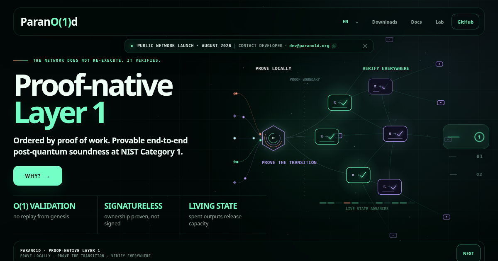

# Parano1d

Official website for [Parano1d](https://parano1d.org), a proof-native Layer 1 secured by proof of work.



- [Documentation](https://docs.parano1d.org)
- [Parano1d Lab](https://lab.parano1d.org)

Independent third-party projects and resources shown under Community builds are maintained in [`ecosystem.json`](ecosystem.json). See [`CONTRIBUTING.md`](CONTRIBUTING.md) before proposing an addition.

## Local preview

The site has no runtime dependencies or build step.

```sh
python3 -m http.server 4171
```

Then open `http://127.0.0.1:4171`.

Validate Community builds changes with:

```sh
python3 scripts/validate_ecosystem.py
```
