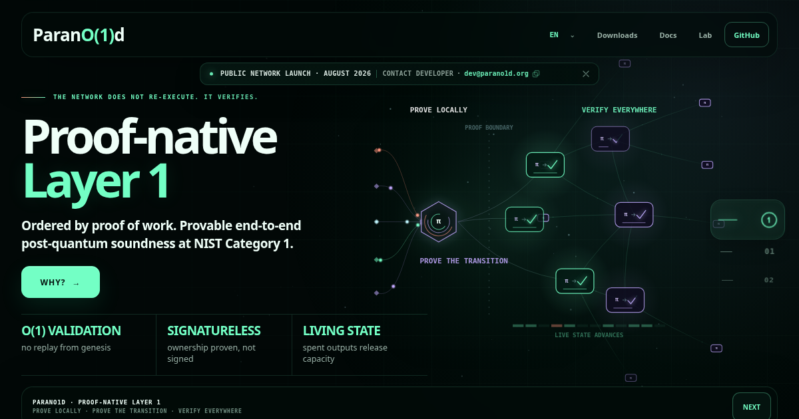

# Parano1d

Official website for [Parano1d](https://parano1d.org), a proof-native Layer 1 secured by proof of work. The site presents the v2 protocol: live value and programmable rights, Small and Large block classes, and scheduled issuance. The message center carries the v2.0.3 release notice, automatic storage fix, optional database reset instructions and activation height. Its new message ID makes it unread for visitors who read v2.0.2, while preserving other read marks.



- [Documentation](https://docs.parano1d.org)
- [Parano1d Lab](https://lab.parano1d.org)

Independent third-party projects and resources shown under Community builds are maintained in [`ecosystem.json`](ecosystem.json). See [`CONTRIBUTING.md`](CONTRIBUTING.md) before proposing an addition.

## Local preview

The site has no runtime dependencies or build step.

```sh
python3 -m http.server 4171
```

Then open `http://127.0.0.1:4171`.

Validate Community builds changes with:

```sh
python3 scripts/validate_ecosystem.py
```

## Source and release links

The Source selector lists [GitHub (ignotusnemo)](https://github.com/ignotusnemo/parano1d) first, followed by the self-hosted [Forgejo repository](https://git.parano1d.org/ignotusnemo/parano1d), identified as canonical, and the [GitLab](https://gitlab.com/ignotusnemo/parano1d) and [GitHub (proof-native)](https://github.com/proof-native/parano1d) mirrors. Third-party projects retain their own repository links.

Downloads include direct Forgejo links to the current release as a static fallback. On the production domain, opening Downloads also checks `/release.json`, a read-only same-origin proxy to Forgejo's `/api/v1/repos/ignotusnemo/parano1d/releases/latest`. It updates the links together only when a stable release contains every expected asset at the correct Forgejo URL. An unavailable endpoint or incomplete release leaves the static links intact. No GitHub API request is made. Local preview uses the static links.
